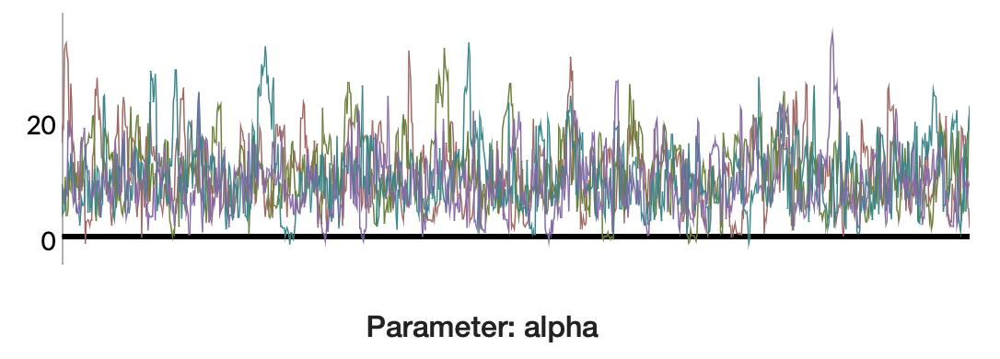
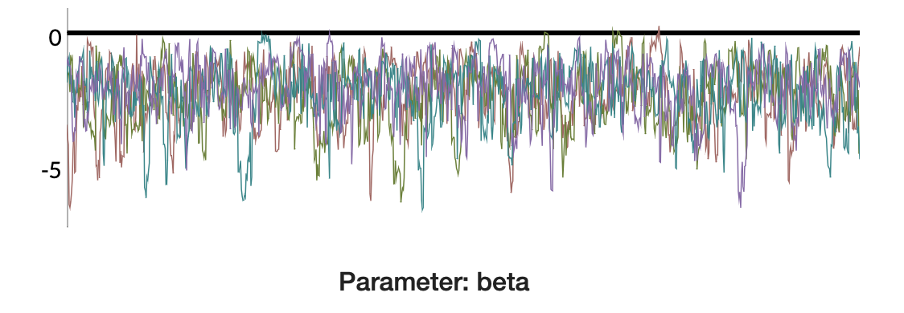
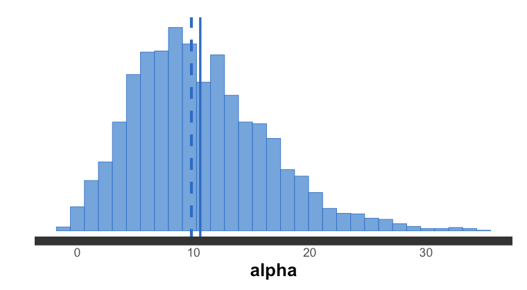
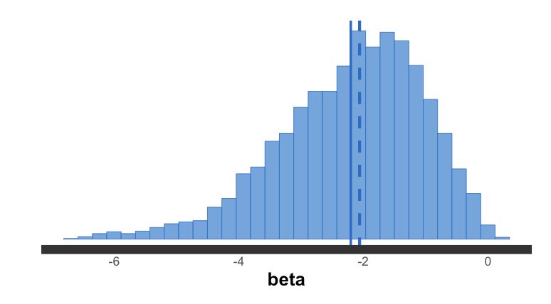

```{r setup, include=FALSE}
knitr::opts_chunk$set(echo = TRUE)
```

```{r include=FALSE}
library(scales)
library(kableExtra)
library(shinystan) 
library(rstan)
```

\newpage

# Practice 3 - Logit Regression

For this practice we are going to use [Stan](https://mc-stan.org/) platform in order to derive the posterior distribution of $\alpha$ and $\beta$ for the observed sample given in the wording of the problem. This tool is a probabilistic programming language that provides full Bayesian inference for continuous variable models using Markov chain Monte Carlo sampling techniques. This allows to compute large hierarchical models to obtain several samples from the posteriors.

Stan can be called from different programming languages, such as R or Python. It can be seen as a program inside these platforms and therefore it needs to be called from them specifying different parameters than the Stan program expects to receive. Hence, we have to provide at least the following three data blocks identified as:

 - `data`: in this section is defined the data that the program will read, that is the sample given in the problem:
 
 |       | $x_1$  | $x_2$ | $x_3$  | $x_4$ | $x_5$  | $x_6$ |
 |-------|--------|-------|--------|-------|--------|-------|
 |  x    |    3   |   5   |    2   |   5   |   10   |   6   |
 |  y    |    1   |   0   |    1   |   1   |    0   |   0   |
 
 - `parameters`: the sample space of the parameters of interest are defined here
 - `model`: the definition of the distribution that our parameters follow
 
Notice that, eventhough it is not mandatory to specify, it can also take other blocks such as transformed data, transformed parameters and generated quantities. 

For our problem, as we want to classify the mission of a plane (binary variable) for the number of hits, we will assume an hierarchical model where:

$$ Y|X,\theta \sim Ber(\theta) \quad \theta = \frac{e^{\alpha+\beta x}}{1+e^{\alpha+\beta x}}$$

$$ log\left(\frac{\theta}{1-\theta}\right) = logit(\theta) = \alpha + \beta x \quad \alpha \sim \mathcal{N}(0,10) \quad \beta \sim Flat \text{ } \pi(\beta)=1 \text{ } \forall \beta \in \mathbb{R}$$

Building the hierarchical model using the Stan tool, we obtain the results shown in the table below about $\alpha$ and $\beta$ parameters.

```{r include=FALSE, cache=TRUE}
mod.stan = "
data {
  int<lower=0> N;
  vector[N] x;
  int<lower=0,upper=1> y[N];
}
parameters {
  real alpha;
  real beta;
}
model {
  alpha ~ normal(0,10);
  y ~ bernoulli_logit(alpha + beta * x);
}
"

y=c(1,0,1,1,0,0)  # for actions (1=success)
x=c(3,5,2,5,10,6) # for the number of bets
fit = stan(model_code = mod.stan, data = list(y = y, x = x, N = length(y)), iter = 2000)
fit_summary <- summary(fit)
```


```{r table.fit, echo = FALSE, include=TRUE}
fit_summary_matrix <- as.matrix(fit_summary$summary)[1:2,]
knitr::kable(fit_summary_matrix, 
             digits = 3) %>% 
  column_spec(1, bold=TRUE) %>% 
  row_spec(0, bold=TRUE) %>% 
  kable_styling(latex_options = "HOLD_position")
```

From the table above, we can see that $\mathbb{E}[\alpha|y]=10.568$ and $\mathbb{E}[\beta|y]=-2.202$ and the credible intervals obtained from the 2.5% and 97.5% quantiles are $CI_{\alpha}=(1.255, 24.127)$ and $CI_{\beta}=(-4.845, -0.348)$.

`Rhat` is the value provided by the counterpart function that produces a result that assesses the convergence diagnostic, which compares the between- and within-chain estimates for model parameters and other univariate quantities of interest. If chains have not mixed well, `Rhat` will be smaller than 0.9 or larger than 1.1. In this case, we can say that it converges properly for both estimators.

Stan results might be executed in a Shiny app that provides more detailed information about the different samples that were computed and its results. All these plots can be seen in the appendix below. Notice that there is a plot indicating the different chain computed. The fact that these chains can be considered "uniform" (because they follow the same path) is a good indicator to consider the estimation provided as correct.

\newpage

# Appendix

## Shiny App results

```{r out.width="50%", fig.show='hold', echo=FALSE, eval=TRUE}


```

The plots above show all the chains together for each of the parameter. We can see all of them follow the same path. 

```{r out.width="50%", fig.show='hold', echo=FALSE, eval=TRUE}


```

In the two histograms above, we can see the mean (solid line) and median (dashed line).

## Code

```{r ref.label=knitr::all_labels(), echo=TRUE, eval=FALSE}


```


